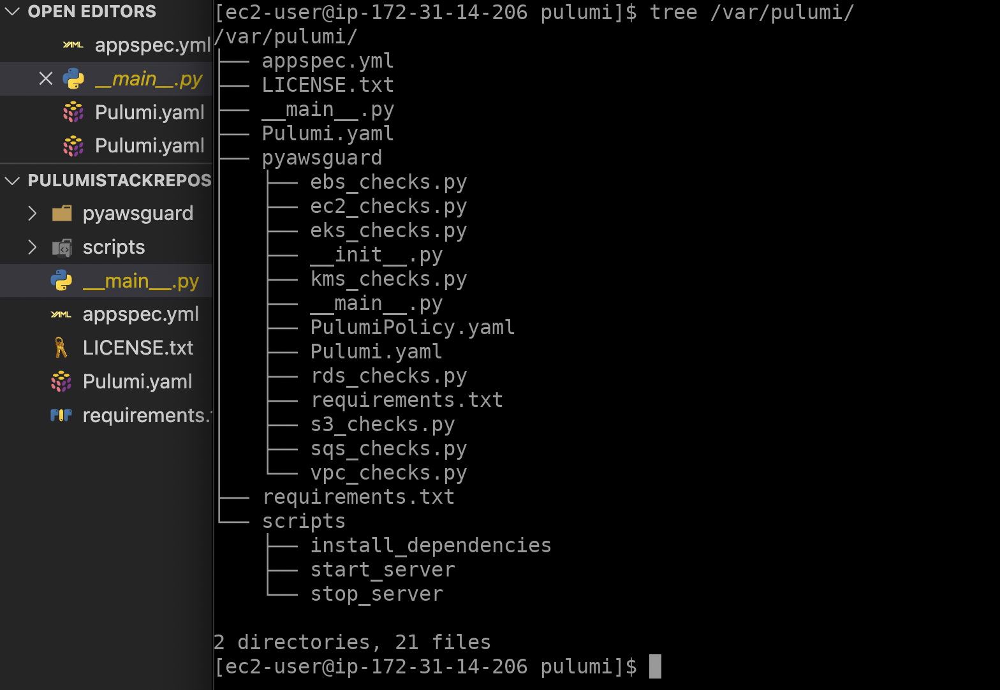

# Pulumi Implementation for AWS CodeCommit, CodeDeploy, and CodePipeline

In this repository, we use CodePipeline to deploy code maintained in a CodeCommit repository to a single Amazon EC2 instance. The pipeline is triggered when we push a change to the CodeCommit repository. The pipeline deploys the changes to an Amazon EC2 instance using CodeDeploy as the deployment service.

The pipeline has two stages:
1. A source stage (Source) for your CodeCommit source action.
2. A deployment stage (Deploy) for your CodeDeploy deployment action.

  

### Step 1: Create a CodeCommit repository
  

### Step 2: Add code to your CodeCommit repository
  

### Step 3: Create an Amazon EC2 Linux instance and install the CodeDeploy agent
  

### Step 4: Create CodeDeploy application and deployment group
  

### Step 5: Create CodePipeline with CodeCommit and CodeDeploy
  

## Reference
- https://docs.aws.amazon.com/codepipeline/latest/userguide/tutorials-simple-codecommit.html